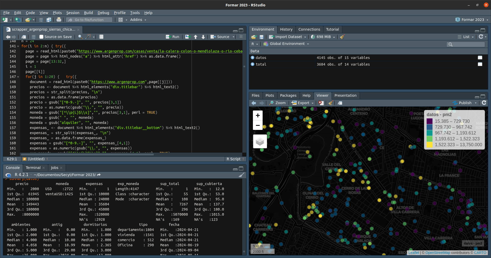

## PIDTA Formar: Desarrollo de estrategias metodológicas para la determinación del precio de los inmuebles edificados en el área metropolitana de la Ciudad de Córdoba utilizando técnicas de aprendizaje computacional y estadística espacial.

### Objetivos generales:

Desarrollar estrategias metodológicas para la determinación del precio de los inmuebles edificados en el área metropolitana de la Ciudad de Córdoba utilizando datos abiertos, técnicas de aprendizaje computacional y estadística espacial.

### Objetivos específicos:

-   OE1: Conformar una muestra de inmuebles edificados en venta o vendidos para conocer la distribución espacial de los precios de mercado.

-   OE2: Identificar y construir variables territoriales consideradas determinantes en la formación de precios de los inmuebles construidos.

-   OE3: Predecir el precio por metro cuadrado de los inmuebles edificados en el área metropolitana de Córdoba.

-   OE4: Identificar el impacto de diferentes variables territoriales en la conformación del precio por metro cuadrado de los inmuebles edificados.

-   OE5: Validar la potencialidad de transferencia del proceso metodológico y sus resultados para su implementación como herramienta para el diseño de políticas públicas.

### Equipo:

-   Mgter. Juan Pablo Carranza (Director)

-   Mgter. Matías Lingua

-   Ing. Renzo Polo

-   Dra. Virginia Monayar

-   Mgter. Federico Monzani

-   Lic. Rocío Cerino

-   Lic. Gastón Fontaine (tesista)

### Avances:

```{r, include=F, echo=F, fig.align='center'}
load("base_de_datos_completa_2024-09-11.Rda")
```

En relación al **OE1** se han diseñado e implementado robots (scrappers) para la extracción automática de información de diferentes portales inmobiliarios web (Argenprop y Zonaprop). De este proceso surge una muestra que, hasta el momento, tiene `r nrow(datos)` observaciones.



Dado que la información de este tipo de portales contempla información de sólo un submercado inmobiliario, la muestra se complementará con observaciones de inmuebles en venta o vendidos en diferentes sectores populares relevadas por la Infraestructura de Datos Espaciales de la Provincia de Córdoba (IDECOR), en colaboración con la UNC, el marco del proyecto "La configuración socio-espacial de las desigualdades urbanas" del Observatorio Social y Cultural para el Desarrollo Sostenible de la SeCyT.

La distribución espacial de la muestra obtenida hasta el momento es la siguiente:

```{=html}
<style>
.html-widget {
    margin: auto;
}
</style>
```
```{r, include=T, echo=F, fig.align='center', warning=F, message=F, out.width = '100%'}
library(RColorBrewer)
datos$pm2 = round(datos$pm2, 0)
mapview::mapview(datos, zcol = "pm2", at = quantile(datos$pm2, probs = seq(0,1,0.2)),
                 col.regions = rev(brewer.pal(6, "Spectral")))
```

En relación al **OE2**


<br></br>

## OSCDS SeCyT: La configuración socio-espacial de las desigualdades urbanas
