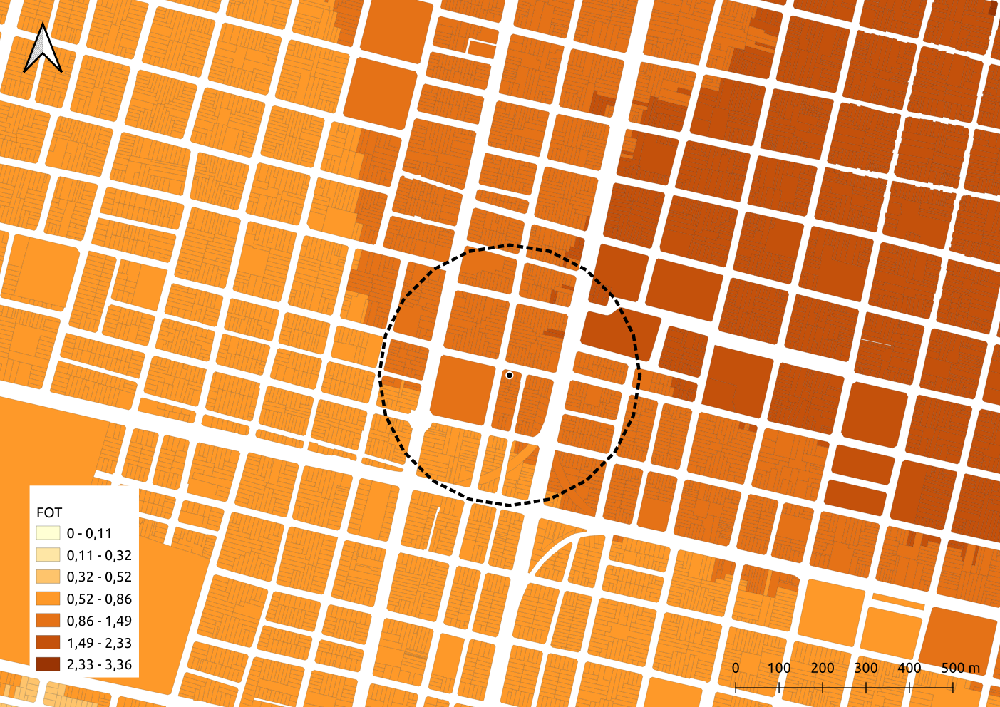
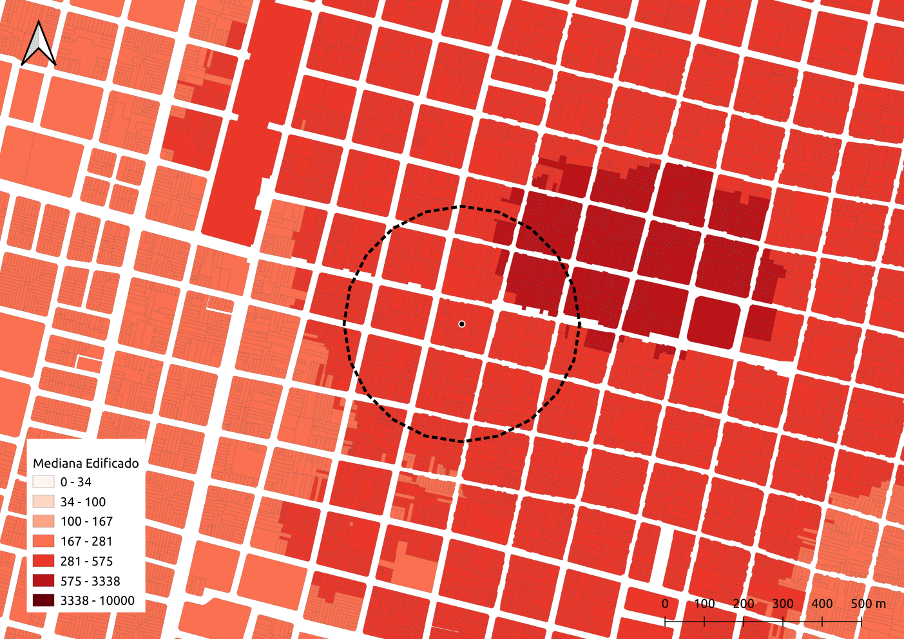
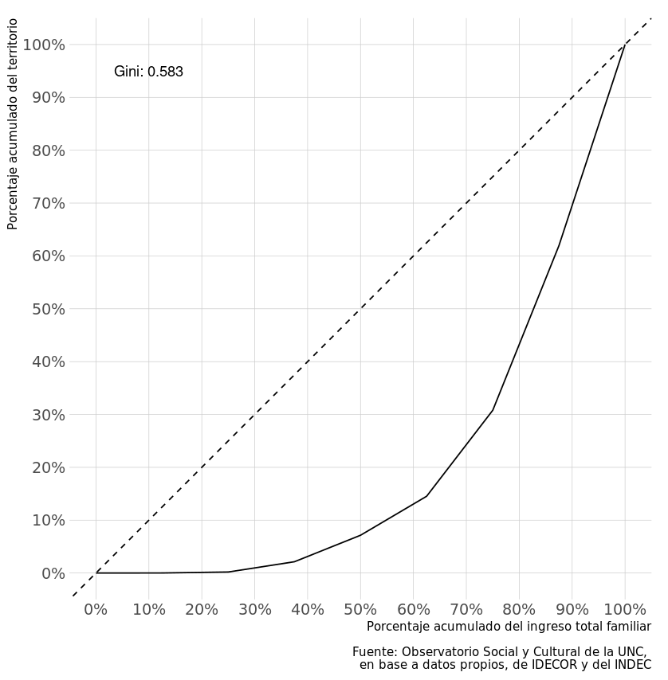
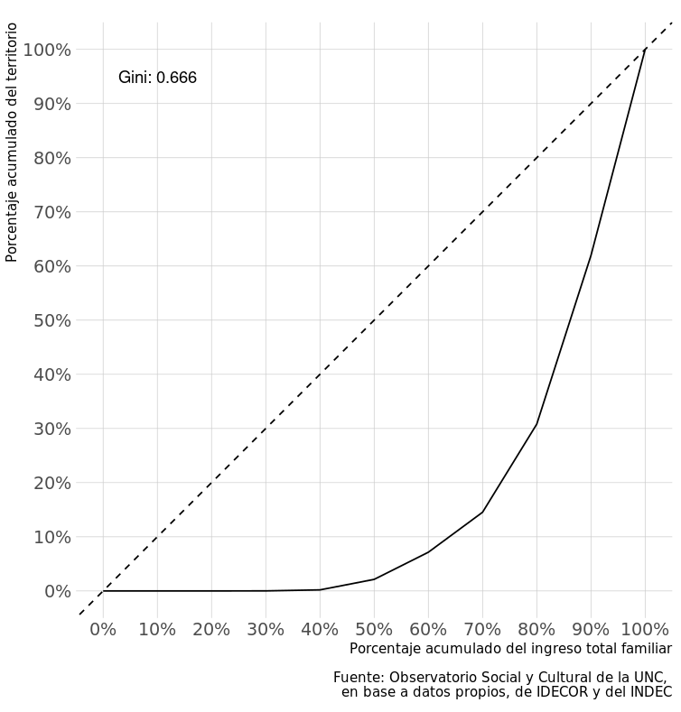

<center>

</center>

<hr style="border:1px solid gray"> </hr>


<center>
<font size="6"> 
Jornadas de Investigación IIFAP 2024
</font>
</center>
<hr style="border:1px solid gray"> </hr>

## 1. PIDTA Formar

**Desarrollo de estrategias metodológicas para la determinación del precio de los inmuebles edificados en el área metropolitana de la Ciudad de Córdoba utilizando técnicas de aprendizaje computacional y estadística espacial.**

### Financiamiento

\$ 250.000 durante 2024.

### Objetivo general

Desarrollar estrategias metodológicas para la determinación del precio de los inmuebles edificados en el área metropolitana de la Ciudad de Córdoba utilizando datos abiertos, técnicas de aprendizaje computacional y estadística espacial.

### Objetivos específicos

-   OE1: Conformar una muestra de inmuebles edificados en venta o vendidos para conocer la distribución espacial de los precios de mercado.

-   OE2: Identificar y construir variables territoriales consideradas determinantes en la formación de precios de los inmuebles construidos.

-   OE3: Predecir el precio por metro cuadrado de los inmuebles edificados en el área metropolitana de Córdoba.

-   OE4: Identificar el impacto de diferentes variables territoriales en la conformación del precio por metro cuadrado de los inmuebles edificados.

-   OE5: Validar la potencialidad de transferencia del proceso metodológico y sus resultados para su implementación como herramienta para el diseño de políticas públicas.

### Equipo

-   Mgter. Juan Pablo Carranza (Director)

-   Mgter. Matías Lingua

-   Ing. Renzo Polo

-   Dra. Virginia Monayar

-   Mgter. Federico Monzani

-   Lic. Rocío Cerino

-   Lic. Gastón Fontaine (tesista)

### Avances \|........\ \ \ \ \ \ \ \ \ \ \ \ \| 40%

```{r, include=F, echo=F, fig.align='center'}
load("base_de_datos_completa_2024-09-11.Rda")
```

En relación al **OE1** se han diseñado e implementado robots (scrappers) para la extracción automática de información de diferentes portales inmobiliarios web (Argenprop y Zonaprop). De este proceso surge una muestra que, hasta el momento, tiene `r nrow(datos)` observaciones.


Dado que la información de este tipo de portales contempla información de sólo un submercado inmobiliario, la muestra se complementará con observaciones de inmuebles en venta o vendidos en diferentes sectores populares relevadas por la Infraestructura de Datos Espaciales de la Provincia de Córdoba (IDECOR), en colaboración con la UNC, el marco del proyecto "La configuración socio-espacial de las desigualdades urbanas" del Observatorio Social y Cultural para el Desarrollo Sostenible de la SeCyT.

La distribución espacial de la muestra obtenida hasta el momento es la siguiente:

<br></br>

```{=html}
<style>
.html-widget {
    margin: auto;
}
</style>
```
```{r, include=T, echo=F, fig.align='center', warning=F, message=F, out.width = '90%'}
library(RColorBrewer)
datos$pm2 = round(datos$pm2, 0)
mapview::mapview(datos, zcol = "pm2", at = quantile(datos$pm2, probs = seq(0,1,0.2)),
                 col.regions = rev(brewer.pal(6, "Spectral")))
```

<br></br>

En relación al **OE2**, se avanzó en el diseño del proceso metodológico para el cálculo de variables independientes con información territorial relevante y con potencial para explicar el precio de las viviendas en el área de estudio, a partir de fuentes de información libres y abiertas. Este proceso metodológico implica el cálculo de variables de distancias, que dan cuenta de la posición relativa de dada parcela urbana, y variables que dan cuenta del entorno específico de cada localización.

| Factor de ocupación del suelo     | Tamaño de edificaciones en el entorno     |
|:-------------------------------------:|:-------------------------------------:|
|                |                |

Entre las variables ya calculadas se encuentran:

-   Distancias a avenidas,
-   Distancias a vías primarias,
-   Distancias a vías secundarias,
-   Distancias a autopistas,
-   Distancias a predios de enterramiento de basura,
-   Distancias a barrios privados,
-   Distancias a barrios populares,
-   Distancias a rios,
-   Distancias a espacios verdes,
-   Cantidad de espacios verdes en el entorno,
-   Área total de espacios verdes en el entorno,
-   Cantidad de comercios en el entorno,
-   Cantidad de metros cuadrados edificados en el entorno,
-   Tamaño promedio de las edificaciones en el entorno,
-   Cantidad de lotes baldíos en el entorno,
-   Entre otras.

### Lo que viene en 2025

* Entrenamientos de machine learning para la predicción del precio de las viviendas en toda el área de estudio.

* Realización de estudios para identificar la contribución relativa de cada una de las variables utilizadas en la formación del precio de las viviendas.

* Realización de talleres con funcionarios de diferentes municipios del área de estudio para sensibilidar sobre la problemática y poner a disposición la metodología propuesta.

<br></br>

## 2. OSCDS SeCyT

**La configuración socio-espacial de las desigualdades. Una propuesta metodológica para determinar el acceso a las oportunidades urbanas y a la vivienda en Córdoba.**

### Financiamiento

\$ 9.000.000 hasta Mayo de 2025.

### 2Objetivo general

Caracterizar la configuración socio-espacial de las desigualdades urbanas, a partir del reconocimiento de las condiciones de acceso a la vivienda y a las oportunidades que la ciudad ofrece.

### Objetivos específicos

* Identificar los sectores de la ciudad en donde la compra/alquiler de vivienda es asequible para diferen tes grupos sociales según criterios socio-económicos y su espacialización en el territorio urbano del Gran Córdoba.

* Reconocer la distribución espacial de las oportunidades en distintos sectores del Gran Córdoba, en relación a la calidad urbana (acceso a servicios, equipamientos, infraestructura, ambiente, entre otras) que los mismos presentan.

* Construir un índice de desigualdad urbana, a partir del reconocimiento de la estructura de oportunidades del territorio y las condiciones de asequibilidad para los distintos grupos sociales según sectores del Gran Córdoba.

* Reconocer las condiciones de vida de la población que habita en sectores, con un acceso más desfavorable a las oportunidades urbanas en el Gran Córdoba, identificando problemas, dificultades, estrategias que se reconocen en esos entramados socio-urbanos.

### Equipo

(21 personas)

-   Dra. Miriam Liborio (Directora)

-   Mgter. Juan Pablo Carranza (Co-Director)

-   INVIHAB, FAUD

-   IIFAP, FCS

-   CET, FCEFyN

-   Departamento de Geografía, FFyH

-   CONICET

-   IDECOR, Gobierno de Córdoba


### Avances \|................\ \ \ \ \ \ \| 70%

Análisis de la accesibilidad a la compra de vivienda a nivel parcelario, en función de los ingresos totales familiares. Se simulan el monto de un crédito hipotecario a 30 años, con una tasa de interés real efectiva del 2% anual, considerando una capacidad de repago igual al 30% de los ingresos del hogar. Ese monto se compara con el precio estimado de las viviendas en toda el área de estudio, identificando los sectores que son accesibles para cada decil en la distribución del ingreso total familiar. 

<br></br>

```{r, include=T, echo=F, fig.align='center', warning=F, message=F, out.width = '90%'}
library(terra)
library(raster)
deciles = rast("accesibilidad_compra.tif")
deciles = raster(deciles)
mapview::mapview(deciles, na.color = "transparent", alpha.regions = 0.6)
```

<br></br>

De igual manera, se estimaron los precios de alquiler de viviendas (tomando como referencia a un inmueble de 60 metros cuadrados) y se compararon con los ingresos de la población, para identificar sectores de acceso exclusivo para los deciles más altos en la distribución del ingreso, y aquellas partes de la ciudad que se encuentran segregadas.

<br></br>

```{r, include=T, echo=F, fig.align='center', warning=F, message=F, out.width = '90%'}
library(terra)
library(raster)
deciles = rast("accesibilidad_alquiler.tif")
deciles = raster(deciles)
mapview::mapview(deciles, na.color = "transparent", alpha.regions = 0.6)
```


<br></br>

Del análisis de esta información surgen cuestiones interesantes respecto al nivel de inequidad en el acceso al espacio urbano. En primer lugar, casi **un 30% de los hogares no podrían acceder a la compra de una vivienda ni aún cuando se pusiera en marcha una política de crédito hipotecario blando** como la simulada en el estudio. Las inequidades se continúan observando en toda la distribución, al punto en el cuál **el 30% de la ciudad sólo es accesible para el 10% más rico** de la población.

En relación a los alquileres, la situación es aún más grave. Del análisis realizado se desprende que, a partir de sus ingresos familiares totales, un **40% de los hogares no pueden alquilar en ningún sector** del área de estudio. Nuevamente, al igual que en el caso de las operaciones de compra de vivienda, cuando se analizan las posibilidades territoriales de alquiler se observa que **un 40% del espacio urbano sólo es accesible para el 10% más rico** de la población. 


| Compra de viviendas    | Alquiler de viviendas     |
|:-------------------------------------:|:-------------------------------------:|
|                |                |


### Lo que viene en 2025

* Etapa cualitativa para la caracterización de los espacios urbanos segregados detectados en el análisis anterior.

<br></br>
